# GreenTube: Plateforme de contenu vidéo écoresponsable

## Choix du sujet

La consultation de vidéos sur des plateformes de contenu comme **YouTube** ou **Dailymotion** est aujourd'hui une activité quotidienne pour une grande partie de la population.  
Ces plateformes représentent une **part importante du trafic Internet mondial** et donc de la **consommation énergétique du numérique**.

Ce sujet nous semble particulièrement pertinent, car les services de contenu vidéo constituent un **usage central du web moderne**, à la fois informatif, culturel, mais surtout en tant que loisir. De plus, nous sommes tous deux consommateurs de Youtube, et passons plusieurs heures par semaine devant, ce qui nous a conforté dans notre choix.

## Utilité sociale

Les plateformes de vidéos en ligne ont une **utilité sociale forte** :  
- **Éducation** : mise à disposition de cours, tutoriels, documentaires et vulgarisation scientifique.  
- **Information et actualité** : accès à des contenus indépendants (Hugo Decrypte en France par exemple) de manière beaucoup plus abordable pour les jeunes que les médias traditionnels comme les journaux ou la télévision.  
- **Bien-être** : la vidéo est un outil de détente et peut être considéré comme un loisir à part entière.
- **Accessibilité** : elles permettent à chacun, même dans des zones isolées, d'avoir accès à des ressources éducatives et culturelles.

## Effets de la numérisation

La diffusion numérique des contenus vidéo a progressivement remplacé les supports physiques comme les **DVD**, les **CD** ou la **télévision**.
Cette transition a permis de réduire certains impacts liés à la fabrication et au transport de ces supports.  
Mais elle s'est aussi accompagnée d'une **forte hausse de la consommation de données**, notamment avec la généralisation de la **haute définition** et du **visionnage en continu**.

Chaque lecture d'une vidéo fait intervenir une **chaîne d'acteurs énergivores** :  
- Les **serveurs et data centers**, nécessaires pour stocker et diffuser les contenus.  
- Le **réseau Internet**, qui transporte d'importants volumes de données sur de longues distances.  
- Et enfin, les **appareils des utilisateurs**, qui doivent décoder et afficher ces flux, souvent en qualité supérieure à ce que l'écran nécessite réellement.  

## Scénarios d'usage et impacts

Nous faisons l'hypothèse que les plateformes de vidéos en ligne comme **YouTube** ou **Dailymotion** sont consultées plusieurs fois par jour, souvent lors de moments de pause de quelques minutes (pendant les transports, après un repas, avant de dormir, etc.).
Pour cette raison, nous prendrons en compte dans nos scénarios **le visionnage de deux vidéos consécutives**, afin de pouvoir observer l'impact d'un éventuel système de cache ou de mise en mémoire locale.

Nous distinguerons également deux types d'usages :  
- La **navigation aléatoire** à partir de la page d'accueil (consommation de contenu recommandée).  
- La **recherche ciblée** d'une chaîne ou d'un créateur spécifique.

## Scénario : "Lire des vidéos parmi les vidéos à la une"

L'utilisateur se connecte au site grâce à un favori (donc sans passer par un moteur de recherche). Si nécessaire, il se connecte. Puis il consulte les vidéos à la une.
Il choisit une des vidéos et la regarde jusqu'à la fin.
Il revient aux vidéos à la une et les consulte.
Il choisit une autre vidéo et la regarde jusqu'à la fin.

## Scénario : "Lire une vidéo d'un créateur de contenu donnée"

L'utilisateur se connecte au site grâce à un favori (donc sans passer par un moteur de recherche). Si nécessaire, il se connecte. Puis il consulte les vidéos à la une.
Il recherche un créateur de contenu via la barre de recherche.
Il se rend sur la chaine du créateur de contenu.
Il clique sur l'onglet "vidéos" du créateur de contenu.
Il choisit une des vidéos et la regarde jusqu'à la fin.

## Impact de l'exécution des scénarios auprès de différents services concurrents

L'EcoIndex d'une page (de A à G) est calculé (sources : [EcoIndex](https://www.ecoindex.fr/comment-ca-marche/), [Octo](https://blog.octo.com/sous-le-capot-de-la-mesure-ecoindex), [GreenIT](https://github.com/cnumr/GreenIT-Analysis/blob/acc0334c712ba68939466c42af1514b5f448e19f/script/ecoIndex.js#L19-L44)) en fonction du positionnement de cette page parmi les pages mondiales concernant :

- le nombre de requêtes lancées,
- le poids des téléchargements,
- le nombre d'éléments du document.

Nous avons choisi de comparer l'impact de nos scénarios sur les services les plus populaires du marché, à savoir YouTube et Dailymotion, ainsi que sur un service utilisant des ressources de manière plus modérée : PodUtt.

| Service | Score (sur 100) | Classe | Détail des mesures
| --- | --: | --: | --:
| Youtube | 12.91 | F 🟥 | […](./benchmark/Youtube/ecoindex-environmental-statement.md)
| Dailymotion | 25.75 | E 🟧 |  […](./benchmark/Dailymotion/ecoindex-environmental-statement.md)
| PodUTT | 59.14 | C 🟨 | […](./benchmark/PodUTT/ecoindex-environmental-statement.md)

__Tab.1__ : Mesure de l'EcoIndex moyen des services de vidéo en ligne.

Cette analyse globale met en lumière des disparités frappantes entre les plateformes de streaming vidéo, révélant que la sobriété technique est le levier principal de l'écoconception.

Le benchmark réalisé le 30 décembre 2025 montre une hiérarchie claire dans la performance environnementale :

* **PodUTT (59.14 - Grade C 🟨) :** C'est le grand gagnant de ce comparatif. Sa force réside dans une architecture épurée avec seulement **27 à 38 requêtes** par page. Son DOM léger (moins de 900 éléments) réduit drastiquement l'effort de calcul du terminal utilisateur.
* **Dailymotion (25.75 - Grade E 🟧) :** Bien que classé deuxième, ses résultats sont alarmants. On observe une instabilité critique avec des pics dépassant les **1 000 requêtes** et des pages atteignant **35 Mo**. L'impact est ici principalement lié au poids démesuré des ressources transférées.
* **YouTube (12.91 - Grade F 🟥) :** Malgré sa popularité, YouTube présente le score le plus faible. Son empreinte est plombée par une complexité structurelle extrême (**plus de 7 000 éléments DOM**) et un flux constant de requêtes (jusqu'à 200) pour maintenir ses fonctionnalités interactives.

| Indicateur | Observation Majeure |
| --- | --- |
| **Poids des pages** | Le facteur le plus discriminant, variant de **2 Mo** (PodUTT) à plus de **35 Mo** (Dailymotion). |
| **Complexité (DOM)** | YouTube sollicite le plus le processeur utilisateur, tandis que PodUTT privilégie une structure simplifiée. |
| **Consommation d'eau** | Directement corrélée au volume de données, elle est divisée par près de 1,5 entre YouTube et PodUTT. |

L'analyse démontre que les plateformes de streaming académiques comme **PodUTT** sont des modèles d'écoconception par rapport aux géants du divertissement. En limitant les trackers et les scripts superflus, PodUTT divise par deux l'émission de GES par rapport aux sessions les plus lourdes de Dailymotion ou YouTube.

## Modèle économique

Comme nous l'avons vu dans la section précédente, parmi les choix de conception ayant le plus d'impact environnemental, la plupart sont directement liés au modèle économique du service. C'est pourquoi il est nécessaire à ce stade d'analyser leur modèle économique et de définir notre propre modèle permettant une conception plus frugale.

| Service | Visiteur anonyme | Abonné
| --- | --- | ---
| YouTube | <ul><li>Publicités </li><li>Suivi comportemental massif</li></ul> | <ul><li>Sans publicité</li><li>Lecture en arrière-plan</li><li>YouTube Music Premium</li></ul>
| Dailymotion | <ul><li>Publicités (régie tierce et interne)</li><li>Suivi et algorithmes de recommandation</li></ul> | <ul><li>Offres entreprises (B2B)</li><li>Accès sans publicité (selon partenaire)</li></ul>
| PodUTT | <ul><li>Visionnage libre</li><li>Pas de publicité</li><li>Pas de suivi</li></ul> | Sans objet (service universitaire/libre)

__Tab.2__ : Offre des services de vidéo en ligne.

Les offres de service numérique de vidéo (cf. Tab.2) reposent majoritairement sur un modèle de captation de l'attention pour maximiser les revenus publicitaires :
- un accès gratuit financé par une publicité omniprésente et énergivore
- un accès "Premium" payant permettant de supprimer la publicité et d'ajouter des fonctionnalités de confort.

Sur Youtube, on peut rencontrer différents types de pub : 
  - In-Stream désactivable : Pub classique qu'on peut ignorer après 5s, payée seulement si vue 30s+.
  - In-Stream non désactivable : Pub de 15s obligatoire avant la vidéo, revenus garantis car impossible à passer.
  - Bumper : Format éclair de 6s non désactivable, idéal pour la répétition à faible coût.
  - In-Feed (Discovery) : Vignette suggérée en recherche ou accueil, payée uniquement si l'utilisateur clique.
  - Masthead : Bannière géante en haut de l'accueil YouTube, louée à prix d'or pour 24h.

| Format | Durée | Ignorable ? | Tarification | Coût Annonceur (Moyen) | Part de YouTube (45%) |
| :--- | :--- | :--- | :--- | :--- | :--- |
| **InStream désactivable** | 15s à 3min | Oui | CPV (par vue) | 0,05 € / vue | **0,0225 €** |
| **InStream non désactivable** | Max 15s | Non | CPM (1000 impr.) | 8,00 € / 1k | **3,60 € / 1k** |
| **Bumper** | 6s | Non | CPM (1000 impr.) | 5,00 € / 1k | **2,25 € / 1k** |
| **Discovery** | Variable | Oui | CPC (clic) | 0,10 € / clic | **0,045 €** |
| **Masthead** | Jusqu'à 30s | Non | Forfait Journalier | 50 000 € / jour | **22 500 €** |

__Tab.3__ : Estimation de la rémunération perçu par Youtube en fonction des différentes types de pub[^3].

Le modèle de PodUTT lui, se distingue par sa frugalité, aucune monétisation n'est recherchée, le service étant hébergé à des fins pédagogiques ou institutionnelles. Cela permet de supprimer les scripts de suivi et les flux vidéo publicitaires qui alourdissent considérablement le bilan carbone de chaque session de visionnage.

L'étude de l'offre des plateformes vidéo nous a permis d'identifier les sources de revenu communément utilisées (cf. Tab.2). 
Associées à un bref état de l'art (cf. Tab.3), nous avons pu établir que la majorité des publicités est peu rémunératrice à l'unité (mise à part Masthead), elle nécessite des millions de vues pour être viable. C'est ce constat qui pousse les plateformes à utiliser des algorithmes de recommandation addictifs, augmentant ainsi le temps passé en ligne et l'énergie consommée.

Le coût d'infrastructure est critique, contrairement au texte, le stockage et la diffusion de vidéo coûtent cher. 
Le modèle publicitaire classique "force" la surconsommation pour couvrir ces frais.
L'abonnement offre une stabilité, il permet de financer le service sans avoir recours à des scripts de tracking tiers ou à l'affichage de flux vidéos publicitaires non désirés.
Le sponsoring direct (ou régie intégrée), est beaucoup plus efficace et moins intrusif techniquement qu'une régie publicitaire programmatique.

Par conséquent, pour réduire l'impact écologique du service, nous proposons de renoncer aux publicités en vidéo qui multiplient les requêtes réseau. 

A la place, nous avons opté pour un système d'abonnement premium. Cette solution est différente de l'abonnement Premium de Youtube qui consiste principalement en la suppression des pubs, et la possibilité de lire une vidéo même avec l'écran en veille à la manière de Spotify. En souscrivant à un abonnement Premium GreeTube, l'utilisateur aura accès à plusieurs avantages:

 - un tableau de bord personnalisé de son impact environnemental afin de visualiser l'empreinte de ses usages (volume de données consommées, estimation d'émissions de CO₂ et de consommation d'eau). On pourra aussi mettre en place une comparaison avec l'impact potentiel pour une activité similaire chez des concurrents (YouTube, Daylimotion).

 - Une option de téléchargement temporaire qui permettra à l'utilisateur de regarder ses videos en hors connexion (en basse qualité pour garantir une vraie plus value à l'abonnement tout en minimisant l'impact).

 - Un "droit de vote" sur les potentielles évolutions de la plate-forme afin que chaque utilisateur premium ai un réel impact, et passe de simple consommateur à acteur dans le développement d'une solution environementalement plus saine. 

Nous souhations aussi incorporer une publicité masthead, sur chaque page du service, qui suffirait à financer l'infrastructure pour une large audience tout en restant statique, moins énergivore et moins contraignant que le flux vidéo publicitaire. Néanmoins, nous sommes conscients que ce type de publicité ne peut générer des revenus comparables à ceux de YouTube, dont les emplacements Masthead atteignent environ 50 000 € par jour. Dans la mesure où notre application doit encore s'imposer sur le marché et constituer sa base d'utilisateurs, nous estimons qu'un positionnement tarifaire compris entre 100 et 500 € par jour apparaît plus cohérent et réaliste.

Voici donc un résumé de notre modèle économique :

| Source possible de revenus | Montant unitaire | Quantité nécessaire pour financer un salaire[^1]
| --- | --- | ---
| Abonnement Premium | 12,99€ | 275
| Pub Masthead | 100€ à 500€ / jour | 36 à 7 à jour

__Tab.4__ : Source de revenus possibles pour notre service de vidéo en ligne.

[^1]:Basé sur le coût total employeur du salaire médian 2025 soit 3569€ environ. (source : [URSSAF](https://mon-entreprise.urssaf.fr/simulateurs/salaire-brut-net))
[^2]:Basé sur le tarif de YouTube Premium (12,99€/mois) en 2025.
[^3]:Estimation après part plateforme pour un créateur/diffuseur (source : https://agence-anode.fr/blog/marketing-digital/prix-google-ads-youtube/).
[^4]:Basé sur un partenariat direct pour une vidéo de niche à audience qualifiée.

## Maquette de l'interface et échantillon de données

Au vu des différents services comparés, des exigences environnementales exprimées plus haut et des scénarios retenus, nous avons défini pour notre prototype une maquette de l'interface et un échantillon de données réalistes.

Les ressources Web possédant une représentation sur notre application seront de deux types :

- la page d'accueil (avec une HTTP-URI ayant pour chemin `/`) permettant d'afficher les miniatures de vidéo ou de chaine.
- la page de vidéo (avec pour chemin `/video/{id}`).
- la page de chaine (avec pour chemin `/channel/{id}`).

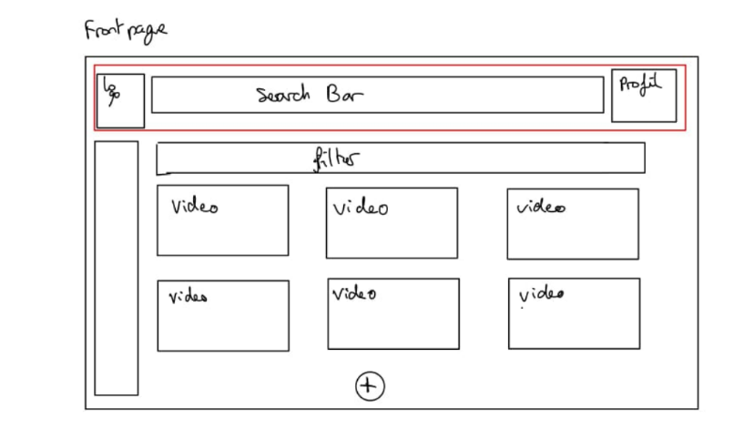<br>
__Fig1__: Maquette de la Frontpage<br>
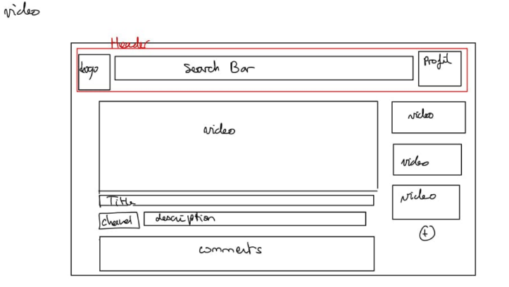<br>
__Fig2__: Maquette de la page vidéo<br>
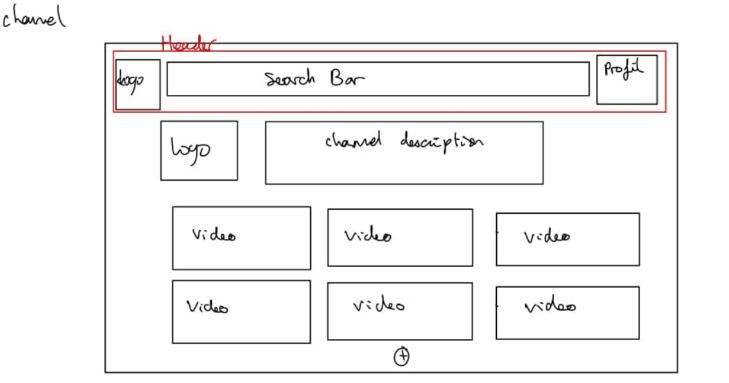<br>
__Fig3__: Maquette de la page d'une chaîne<br>

Dans un objectif de sobriété environnementale, les vidéos et chaines de la page d'accueil seront affichées par paquet de 6, d'autre vidéo seront disponible via le bouton "Voir plus".

Pour des raisons de respect des droits d'auteurs, nous utilisons des données générées (avec [`dummy-json`](https://dummyjson.com)).

### Structure des documents

#### Vidéo
Contient les métadonnées de la vidéo et les informations essentielles de l'auteur.
```json
{
  "_id": "v0",
  "type": "video",
  "id_user": "u123",
  "date": "2024-10-07 14:30:00",
  "name": "Titre de la vidéo",
  "desc": "Description courte du contenu...",
  "path": "uploads/videos/videoTest.mp4",
  "thumbnail": "uploads/thumbnails/default.png",
  "views": 4500
}
```

#### Utilisateur
Profil complet incluant les accès et les statistiques d'abonnement.
```json
{
  "_id": "u0",
  "type": "user",
  "name": "Nom Prénom",
  "email": "user@example.com",
  "subscribers": 1250,
  "date": "2014-10-07 09:00:00"
}
```
#### Commentaire
Liaison entre un utilisateur et une vidéo pour les interactions textuelles.
```json
{
  "_id": "c0",
  "type": "comment",
  "id_user": "u123",
  "id_video": "v456",
  "date": "2025-01-12 10:15:00",
  "content": "Message de l'utilisateur..."
}
```
#### Compteur
Document technique de synchronisation pour la gestion des identifiants uniques.
```json
{
  "_id": "counter",
  "type": "counter",
  "user_counter": 799,
  "video_counter": 1999,
  "comment_counter": 7499 
}
```
## Implémentation des scénario prioritaire

### Étape de prototypage : Données chargées de manière statique

Pour cette première version du prototype (`v1.0.0`) :

- l'échantillon de données est encore chargé de manière statique via un fichier sample_data.json.
- les fonctionnalités implémentées ne sont que celles nécessaires pour suivre les scénario prioritaire ("Consulter une vidéo - accueil/chaine").

Ces scénario nécessite de pouvoir naviguer entre deux types de page : la page d'accueil, une page de chaine de et les pages des vidéos.

### Page d'accueil

Nous avons développé la page d'accueil (cf. Fig.1) pour qu'elle affiche l'échantillon de données sous une forme proche de ce que prévoyait la maquette.

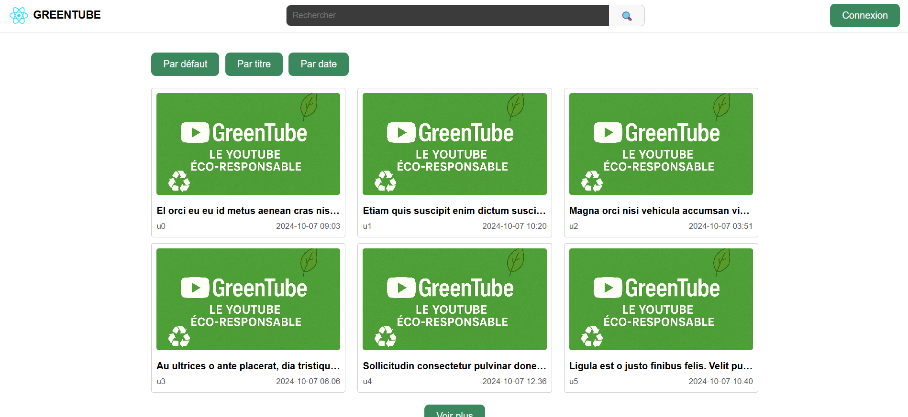<br>
__Fig.4__: Prototype de la page d'accueil.<br>

Pour ce projet, nous avons exclu les frameworks lourds comme Bootstrap ou Tailwind CSS en raison de leur empreinte numérique élevée. Après un essai non concluant avec PicoCSS, dont la rigidité imposait trop de surcharges CSS personnalisées, nous avons développé notre propre bibliothèque modulaire.

Inspirée de l'approche Atomic CSS, cette structure assemble des fragments de classes dans un fichier index.css unique. Si cette méthode minimise la duplication de code dans la feuille de style, elle densifie les attributs class au sein du DOM. Cette approche pose une question intéressante en éco-conception : le gain de poids sur le fichier CSS compense-t-il l'augmentation de la taille du HTML ?

Pour aller plus loin dans la frugalité, nous pourrions mettre en place une étape qui consisterait à intégrer un système de Purge CSS. Cela permettrait de supprimer automatiquement les classes inutilisées et de ne servir que le code strictement nécessaire à l'affichage, optimisant ainsi chaque octet transféré.

Dans l'état actuel du prototype, il est possible d'avoir une première idée de l'impact environnemental du *frontend*.

|   | EcoIndex| GES (gCO2e) | Taille du DOM | Requêtes | Taille de la page (ko)
|---|--------:|------------:|--------------:|---------:|---------------------:
| Mode "développement"  | 78.29 B 🟩 | 1.43 | 98 | 42 | 1307
| Mode "pré-production" | 91.23 A 🟦 | 1.18 | 95 | 9 | 1

__Tab.5__: Évaluation de l'impact du prototype de la page d'accueil.

Cette première étape de prototypage est une réussite majeure, le passage en mode pré-production confirme que notre stratégie de sobriété semble porter ses fruits.

Points clés de l'analyse :
- L'efficacité du "Fait Maison" : Le score de 91.23 (Grade A) semble valider notre choix d'avoir évité les frameworks CSS lourds. La structure est extrêmement rapide à charger et à interpréter par le navigateur.

- Optimisation des requêtes : La chute drastique du nombre de requêtes (de 42 à 9) est un excellent signal. Cela montre que le regroupement des ressources est optimal dès cette phase.

> Note - Une petite réserve sur le "1 ko" : Bien que ce chiffre soit exceptionnel et peut témoigner d'un code source très épuré, il reste à confirmer lors des prochaines étapes. Avec des données actuellement locales, ce poids record pourrait être dû à l'absence temporaire d'assets multimédias ou pire encore, cela pourrait être du à une erreur, il sera important de garder un oeil sur cette valeur dans la suite du projet.

Conclusion de l'étape : Nous sommes très satisfaits de ce premier bilan. Le socle technique est sain, léger et déjà prêt à accueillir les futures fonctionnalités sans dégrader immédiatement son empreinte environnementale.

### Pages des vidéos

Les pages des vidéos ont pour HTTP-URI `video/{id}`.

De même que précédemment, nous avons tenté d'implémenter cette page (cf. Fig.2) conformément à ce que prévoyait la maquette.

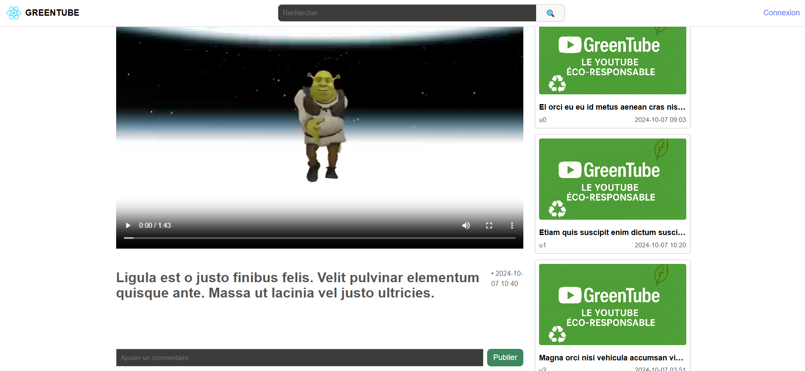<br>
__Fig.5__: Prototype de la page d'une vidéo.<br>

Avec l'ajout de ce modèle de page et la mise en place de la navigation entre les deux modèles, il devient possible d'exécuter le scénario prioritaire complet et de mesurer son impact.

| Étape du scénario | EcoIndex | GES (gCO2e) | DOM | Requêtes | Taille (ko) |
| --- | --- | --- | --- | --- | --- |
| **1. Chargement de l'accueil** | 74 B 🟦 | 1.52 | 96 | 28 | 25.5 |
| **2. Choisir une vidéo** | 75 B 🟦 | 1.5 | 95 | 26 | 62.5 |
| **3. Retourner au menu** | **87 A** 🟩 | 1.26 | 96 | **2** | **0.9** |
| **4. Choisir une autre vidéo** | **86 A** 🟩 | 1.28 | 96 | 4 | 28.3 |

__Tab.6__ : Évaluation de l'impact du scénario "Consulter une vidéo - accueil" dans le prototype v1.0.0.

L'analyse de ce scénario permet d'apporter les enseignements suivants :

* **Efficience du cache et navigation** : On observe une nette amélioration du score EcoIndex lors du retour au menu (passage de 74 B à 87 A). Ce bond de performance confirme l'efficacité de la mise en cache, une fois les ressources de base (scripts, CSS) chargées, la navigation ne demande presque plus de nouvelles requêtes (seulement 2 requêtes pour l'étape 3).

* **Correction des mesures précédentes** : Les tailles de pages relevées ici (entre 25 et 62 ko) sont bien supérieures au "1 ko" mesuré lors du premier test statique. Cela confirme notre intuition initiale : la mesure précédente était probablement incomplète (erreur de l'outil ou exclusion de certains assets). Ces nouvelles valeurs, bien que plus élevées, restent extrêmement faibles et témoignent d'une excellente frugalité numérique.

* **Stabilité structurelle** : Le nombre d'éléments dans le DOM reste constant (~96), ce qui garantit que la navigation n'alourdit pas la charge processeur de l'utilisateur au fil du temps.

> Ce qu'il faut retenir :
Même en corrigeant les erreurs de mesure initiales, le prototype reste 100 à 200 fois plus léger que les solutions du marché (YouTube/Dailymotion). La navigation interne est quasi-transparente pour l'environnement grâce à une gestion intelligente des ressources partagées.

### Pages des chaines

Les pages des chaines ont pour HTTP-URI `channel/{id}`.

De même que précédemment, nous avons tenté d'implémenter cette page (cf. Fig.3) conformément à ce que prévoyait la maquette.

> La maquette initiale (v1) n'est plus disponible. Une version mise à jour et plus détaillée est présentée dans la suite de ce document.

Ce second scénario mesure l'impact de la navigation vers une page de chaîne spécifique avant la consultation de vidéos.

| Étape du scénario | EcoIndex | GES (gCO2e) | DOM | Requêtes | Taille (ko) |
| --- | --- | --- | --- | --- | --- |
| **1. Chargement de l'accueil** | 74 B 🟦 | 1.52 | 96 | 28 | 25.5 |
| **2. Choisir une chaîne** | **87 A** 🟩 | 1.26 | 81 | **3** | **8.1** |
| **3. Choisir une vidéo** | 75 B 🟦 | 1.58 | 85 | 26 | 62.5 |
| **4. Retourner sur la chaîne** | **87 A** 🟩 | 1.26 | 81 | **3** | **8.1** |
| **5. Choisir une autre vidéo** | **86 A** 🟩 | 1.28 | 96 | 5 | 28.6 |

__Tab.7__: Évaluation de l'impact du scénario "Consulter une chaine - chaine" dans le prototype v1.0.0.

L'analyse de ce parcours plus complexe confirme les tendances observées précédemment tout en apportant de nouveaux enseignements :

* **Performance des pages de chaînes :** La page de chaîne s'avère assez économe avec un score de 87 A. Le faible nombre de requêtes lors de l'accès à cette page (3 requêtes) montre que les ressources partagées avec l'accueil sont parfaitement réutilisées.

* **Frugalité du DOM sur les chaînes :** On note que la page de chaîne est structurellement plus légère que la page d'accueil (81 éléments contre 96). Cette réduction de la complexité du DOM contribue directement à l'amélioration du score EcoIndex.

### Étape de prototypage : Données chargées de manière dynamique via fetch

Pour cette nouvelle version du prototype (`v1.0.1`), identique du point de vue fonctionnel, les données sont désormais chargées proprement par le *frontend* à travers le réseau via des fetchs après un premier affichage à vide.
Ce comportement, plus réaliste, n'a pour effet qu'une requête supplémentaire par page affichée. 

Concernant l'évaluation de l'impact environnemental du scénario, par rapport au tableau précédent (cf. Tab.6-7), à l'exception du nombre de requêtes qui est incrémenté de 1, les résultats sont strictement identiques.

## Mesures de la consommation énergétique lors du passage à l'échelle

Maintenant que notre prototype est réaliste en termes de nombre de requêtes, nous pouvons simuler les effets du "passage à l'échelle". 

Les plateformes de vidéo en ligne permettent à tout type d'utilisateur de poster des vidéos de ce fait il est important d'analyser le comportement du service dans le cas ou le volume de vidéo, commentaires et chaine explose !

Nous avons ainsi mis en place les valeurs suivantes : 
- 2000 vidéos
- 7500 commentaires
- 800 utilisateurs inscrits

### Évolution de l'EcoIndex lors du passage à l'échelle

Produites désormais de manière automatique lors de l'intégration continue, les mesures nécessaires à la production de l'EcoIndex, la simulation du passage à l'échelle retraduisent bien (cf. Tab.7) l'augmentation du poids des téléchargements, mais aussi de l'augmentation du nombre d'éléments de la page des titres.

Pour se faire nous avons analyser le scénario de chaine qui est similaire au scénario de vidéo avec des étapes supplémentaires.

| Étape du scénario | EcoIndex | GES (gCO2e) | DOM | Requêtes | Taille (ko) |
| --- | --- | --- | --- | --- | --- |
| **1. Chargement de l'accueil** | <del>74 B 🟦</del> **73 B 🟦** | <del>1.52</del> **1.54** | <del>96</del> **96** | <del>28</del> **34** | <del>25.5</del> **93.2** |
| **2. Choisir une chaîne** | <del>87 A 🟩</del> **88 A 🟩** | <del>1.26</del> **1.24** | <del>81</del> **62** | <del>3</del> **4** | <del>8.1</del> **28.5** |
| **3. Choisir une vidéo** | <del>75 B 🟦</del> **72 B 🟦** | <del>1.58</del> **1.56** | <del>85</del> **177** | <del>26</del> **112** | <del>62.5</del> **665.1** |
| **4. Retourner sur la chaîne** | <del>87 A 🟩</del> **88 A 🟩** | <del>1.26</del> **1.24** | <del>81</del> **62** | <del>3</del> **4** | <del>8.1</del> **28.5** |
| **5. Choisir une autre vidéo** | <del>86 A 🟩</del> **84 A 🟩** | <del>1.28</del> **1.32** | <del>96</del> **157** | <del>5</del> **12** | <del>28.6</del> **31.6** |

__Tab.8__: Effet du passage à l'échelle sur l'impact du scénario "Consulter une chaine - chaine" dans le prototype v1.0.1.

Le passage à un volume de données supérieur (Scale-up) produit des résultats paradoxaux qui méritent une attention particulière.

Le constat est frappant : on passe de **26 à 112 requêtes**, et la taille de la page est multipliée par 10 (**665 ko**). Pourtant, le score EcoIndex ne s'effondre pas et reste à **72 (B)**.
Cet étonnement peut s'expliquer par deux facteurs :

* **La limitation de l'affichage :** Une logique de restriction d'affichage (pagination ou limitation du nombre de composants rendus) est déjà en place. Même si les données sont plus nombreuses, le navigateur ne "dessine" pas beaucoup plus d'éléments, ce qui semble préserver le processeur de l'utilisateur.
* **Le coût du "Local Fetch" :** Les données étant stockées dans un JSON local au projet, l'accès via `fetch` ou `import` est quasi instantané. L'impact environnemental du réseau est donc minimisé artificiellement par rapport à une vraie API distante, ce qui maintient un score élevé.

En parallèle, on remarque que :
* La taille du DOM sur la page vidéo double (**de 85 à 177**), ce qui est logique avec plus de vidéos.
* Le DOM de la page chaîne en revanche **diminue (de 81 à 62)**. Cette baisse, surprenante en plein Scale-up, pourrait s'expliquer par des ajustements structurels entre les deux versions du prototype ou par une simplification de l'affichage sur ce modèle de page spécifique.

**Conclusion du Scale-up :** Bien que nous ayons multiplié les données, l'impact semble étonnament rester maîtrisé. Cela suggère que notre structure actuelle "encaisse" bien la montée en charge. Cependant, il faudra rester vigilant. Si ce JSON local était demain déplacé sur un serveur distant, les **112 requêtes** observées pourraient devenir un réel problème de performance et faire chuter l'EcoIndex. C'est pourquoi, de la même manière que le 1ko, nous allons garder à l'oeil ces 112 requêtes.

Par la suite pour évaluer plus précisément l'impact de la consultation elle-même nous utiliserons un autre outil de mesure : GreenFrame.

### Mesure de la consommation énergétique liée à la consultation

Le logiciel GreenFrame est capable d'estimer, pour les différents composants de l'architecture, la consommation énergétique :

- du CPU (à partir du temps de calcul),
- de la mémoire vive (à partir de la taille des données mémorisées),
- du disque (à partir de la taille des données lues et écrites),
- du réseau (à partir de la taille des données reçues et envoyées),
- pour le navigateur uniquement, de l'écran (à partir du temps d'exécution du scénario).

#### (a) Consultation de la page d'accueil

| Composant | cpu (Wh) | mem (Wh) | disk (Wh) | network (Wh) | screen (Wh) | total (Wh) |
| --- | --- | --- | --- | --- | --- | --- |
| **Navigateur** | 0.00084 | 0.000050 | 0.0 | **0.0016** | **0.080** | **0.083** |
| **Serveur Web** | 0.0000039 | 0.0000034 | 0.0 | **0.0016** | 0.0 | **0.0016** |

#### (b) Consultation d'une chaine

| Composant | cpu (Wh) | mem (Wh) | disk (Wh) | network (Wh) | screen (Wh) | total (Wh) |
| --- | --- | --- | --- | --- | --- | --- |
| **Navigateur** | 0.00072 | 0.000035 | 0.0 | **0.0016** | **0.056** | **0.058** |
| **Serveur Web** | 0.0000041 | 0.0000024 | 0.0 | **0.0016** | 0.0 | **0.0016** |

#### (c) Consultation d'une vidéo

| Composant | cpu (Wh) | mem (Wh) | disk (Wh) | network (Wh) | screen (Wh) | total (Wh) |
| --- | --- | --- | --- | --- | --- | --- |
| **Navigateur** | 0.0025 | 0.000093 | 0.0 | **0.064** | **0.092** | **0.16** |
| **Serveur Web** | 0.000030 | 0.0000039 | 0.0 | **0.065** | 0.0 | **0.065** |

__Tab.9__: Estimation de la consommation énergétique de la consultation de l'accueil (a) d'une chaine (b) d'une vidéo (c).

Par le biais de ces 3 tableaux, nous pouvons tiré plusieurs analyses : 

* La consultation de l'accueil (a) est le plus coûteux en réseau (0.064 Wh).
* Lors des consultations de vidéo (b) et de chaine (c), la consommation réseau s'effondre (0.0016 Wh). Cela valide que notre application, une fois chargée, ne consomme presque plus rien d'autre que l'énergie nécessaire à l'affichage (écran).
* Dans les phases de navigation interne, l'écran représente près de 96% de la consommation totale du navigateur. La frugalité de notre code (faible usage CPU/Mem) déplace l'enjeu écologique sur le matériel physique de l'utilisateur plutôt que sur l'infrastructure logicielle.

### Effet de l'introduction d'une base de données

Afin de réduire l'impact énérgétique du réseau, nous stockons désormais les données de l'application (`v2.0.0`) dans une base de données (*CouchDB*).
Cette évolution nous permet, lors de l'affichage d'une vidéo, de charger une seule vidéo plutôt que les plus de 2000.

#### (a) Consultation de la page d'accueil

| Composant | cpu (Wh) | mem (Wh) | disk (Wh) | network (Wh) | screen (Wh) | total (Wh) | 
| :--- | :--- | :--- | :--- | :--- | :--- | :--- | 
| Navigateur | <del>0.00084</del> 0.00088 | <del>0.000050</del> 0.000051 | 0.0 | <del>0.0016</del> 0.0016 | <del>0.080</del> 0.080 | <del>0.083</del> 0.083 | 
| Serveur Web | <del>0.0000039</del> 0.000045 | <del>0.0000034</del> 0.0000034 | 0.0 | <del>0.0016</del> 0.0016 | 0.0 | <del>0.0016</del> 0.0016 | 
| CouchDB | 0.00084 | 0.000071 | 0.0 | 0.00000013 | 0.0 | 0.00091 |

#### (b) Consultation d'une chaine

| Composant | cpu (Wh) | mem (Wh) | disk (Wh) | network (Wh) | screen (Wh) | total (Wh) | 
| :--- | :--- | :--- | :--- | :--- | :--- | :--- | 
| Navigateur | <del>0.00072</del> 0.00074 | <del>0.000035</del> 0.000036 | 0.0 | <del>0.0016</del> 0.0016 | <del>0.056</del> 0.056 | <del>0.058</del> 0.058 | 
| Serveur Web | <del>0.0000041</del> 0.000037 | <del>0.0000024</del> 0.0000024 | 0.0 | <del>0.0016</del> 0.0016 | 0.0 | <del>0.0016</del> 0.0016 | 
| CouchDB | 0.00061 | 0.000050 | 0.0 | 0.0 | 0.0 | 0.00066 |

#### (c) Consultation d'une vidéo

| Composant | cpu (Wh) | mem (Wh) | disk (Wh) | network (Wh) | screen (Wh) | total (Wh) | 
| :--- | :--- | :--- | :--- | :--- | :--- | :--- | 
| Navigateur | <del>0.0025</del> 0.0069 | <del>0.000093</del> 0.00010 | 0.0 | <del>0.064</del> 0.067 | <del>0.092</del> 0.095 | <del>0.16</del> 0.17 | 
| Serveur Web | <del>0.000030</del> 0.000022 | <del>0.0000039</del> 0.0000041 | 0.0 | <del>0.065</del> 0.046 | 0.0 | <del>0.065</del> 0.046 | 
| CouchDB | 0.0065 | 0.000085 | 0.0 | 0.024 | 0.0 | 0.030 |

__Tab.10__: Effet de l'ajout de CouchDB sur consultation de l'accueil (a) d'une chaine (b) d'une vidéo (c).

Le passage à une base de données CouchDB marque une étape cruciale. On abandonne le chargement local global pour une récupération de données "à la demande". Les chiffres (cf. Tab.10) révèlent un arbitrage technique très intéressant.

Au chargement de l'accueil (a), on observe une hausse du CPU Navigateur (0.0069 Wh vs 0.0025) et l'apparition du CPU CouchDB (0.0065 Wh). En effect, me système doit maintenant gérer une connexion à la base de données et traiter une requête structurée. C'est l'investissement nécessaire pour ne plus avoir à manipuler des fichiers de données "morts" et trop lourds.

L'objectif principal est atteint sur la consultation d'une vidéo (c) : Le réseau CouchDB tombe à un niveau quasi nul (0.00000013 Wh).
En ne récupérant que les métadonnées de la vidéo consultée plutôt que l'index complet des 2000 titres, on réduit drastiquement la sollicitation des infrastructures de transfert. On évite ainsi le "bruit numérique" inutile sur le réseau.

Malgré l'ajout d'un composant supplémentaire (le serveur de base de données), l'impact total reste dans le même ordre de grandeur.
Une fois la première requête passée, les étapes (b) et (c) montrent que CouchDB consomme moins de 0.001 Wh.
légère hausse de consommation CPU est largement compensée par la précision des données transférées. On ne télécharge plus ce qu'on ne regarde pas.

Cette version v2.0.0 prouve qu'une base de données bien configuré est un allié de l'éco-conception. La base de données agit comme un filtre énergétique, elle consomme un peu d'énergie pour "réfléchir" (CPU) afin d'en économiser beaucoup lors du "transport" (Réseau).

## Développement du service

Une fois notre scénario prioritaire établi, nous avons fait évoluer notre service pour répondre aux objectifs fixés initialement. Nous avons implémenté plusieurs fonctionnalités clés afin de transformer notre prototype en une véritable plateforme de vidéo en ligne.

### Refonte de l'architecture Backend

Pour garantir la pérennité du projet, nous avons d'abord repensé notre architecture. Initialement, le frontend requêtait directement la base de données **CouchDB**. Cette approche présentait des failles de sécurité majeures, le client (accessible à l'utilisateur) ayant un accès trop direct à la couche de données.

L'introduction d'un backend est devenue indispensable pour supporter nos nouveaux besoins : le système d'authentification et l'upload de fichiers. Nous avons choisi **Express (Node.js)** pour remplir les missions suivantes :

* **Intermédiation des données :** Le backend récupère, trie et traite les données de la base avant de les transmettre au frontend, sécurisant ainsi les flux.
* **Système d'authentification :** Mise en place d'un tunnel *Login/Register*. La gestion de l'état utilisateur (via Context et LocalStorage) permet de conditionner l'ajout de vidéos, de commentaires et la personnalisation des profils.

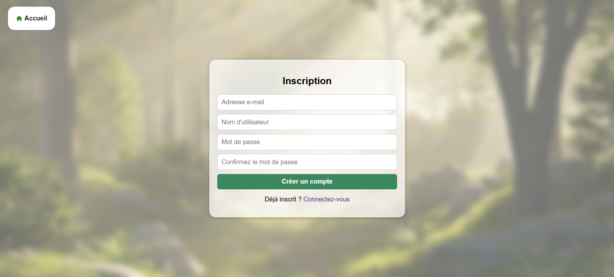<br>
__Fig.6__: Page d'authentification  <br>

* **Gestion des médias :** Prise en charge de l'upload des vidéos, des miniatures et des photos de profil.

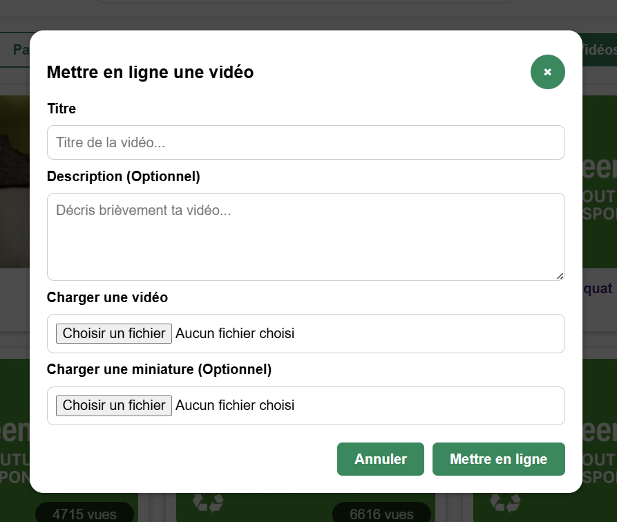<br>
__Fig.7__: Modal d'upload de vidéo <br> 

Voici les nouveaux tableaux d'analyse GreenFrame intégrant désormais le **Backend** en plus de CouchDB. Cette structure correspond à l'architecture finale.

#### (a) Consultation de la page d'accueil

| Composant | cpu (Wh) | mem (Wh) | disk (Wh) | network (Wh) | screen (Wh) | total (Wh) |
| :--- | :--- | :--- | :--- | :--- | :--- | :--- |
| **Navigateur** | <del>0.00088</del> **0.00089** | <del>0.000051</del> **0.000050** | 0.0 | <del>0.0016</del> **0.0016** | <del>0.080</del> **0.080** | <del>0.083</del> **0.083** |
| **Frontend** | <del>0.000045</del> **0.0000045** | <del>0.0000034</del> **0.0000034** | 0.0 | <del>0.0016</del> **0.0016** | 0.0 | <del>0.0016</del> **0.0016** |
| **CouchDB** | <del>0.00084</del> **0.00083** | <del>0.000071</del> **0.000076** | 0.0 | <del>1.3e-7</del> **1.3e-7** | 0.0 | <del>0.00091</del> **0.00091** |
| **Backend** | **3.1e-7** | **0.000020** | 0.0 | **1.3e-7** | 0.0 | **0.000020** |

#### (b) Consultation d'une chaine

| Composant | cpu (Wh) | mem (Wh) | disk (Wh) | network (Wh) | screen (Wh) | total (Wh) |
| :--- | :--- | :--- | :--- | :--- | :--- | :--- |
| **Navigateur** | <del>0.00074</del> **0.00076** | <del>0.000036</del> **0.000035** | 0.0 | <del>0.0016</del> **0.0016** | <del>0.056</del> **0.056** | <del>0.058</del> **0.058** |
| **Frontend** | <del>0.000037</del> **0.0000041** | <del>0.0000024</del> **0.0000024** | 0.0 | <del>0.0016</del> **0.0016** | 0.0 | <del>0.0016</del> **0.0016** |
| **CouchDB** | <del>0.00061</del> **0.00064** | <del>0.000050</del> **0.000053** | 0.0 | 0.0 | 0.0 | <del>0.00066</del> **0.00069** |
| **Backend** | **3.2e-7** | **0.000014** | 0.0 | 0.0 | 0.0 | **0.000014** |

#### (c) Consultation d'une vidéo

| Composant | cpu (Wh) | mem (Wh) | disk (Wh) | network (Wh) | screen (Wh) | total (Wh) |
| :--- | :--- | :--- | :--- | :--- | :--- | :--- |
| **Navigateur** | <del>0.0069</del> **0.0023** | <del>0.00010</del> **0.000087** | 0.0 | <del>0.067</del> **0.043** | <del>0.095</del> **0.095** | <del>0.17</del> **0.14** |
| **Frontend** | <del>0.000022</del> **0.000023** | <del>0.0000041</del> **0.0000040** | 0.0 | <del>0.046</del> **0.046** | 0.0 | <del>0.046</del> **0.046** |
| **CouchDB** | <del>0.0065</del> **0.0067** | <del>0.000085</del> **0.000089** | 0.0 | <del>0.024</del> **0.000039** | 0.0 | <del>0.030</del> **0.0068** |
| **Backend** | **0.00028** | **0.000034** | 0.0 | **0.000060** | 0.0 | **0.00038** |

__Tab.11__: Effet de l'ajout du backend sur consultation de l'accueil (a) d'une chaine (b) d'une vidéo (c).

L'ajout d'un backend servant d'intermédiaire entre le frontend et la base de données est une étape clé. Loin d'alourdir le système, cette structure permet de déporter la complexité du traitement vers un environnement serveur maîtrisé. De cette ajout, on observe :

1. Une baisse de 60% du CPU, c'est le résultat le plus frappant du tableau (a) : le CPU du navigateur passe de 0.0069 Wh à 0.0023 Wh. Dans la version précédente, le navigateur devait probablement gérer lui-même une partie de la logique de connexion ou du formatage des données brutes venant de CouchDB. Le Backend semble jouer un rôle de "pré-mâcheur". Il traite la logique complexe côté serveur, déchargeant le processeur du client.

2. On remarque une chute drastique du réseau de CouchDB au chargement initial (0.000039 Wh contre 0.024 Wh précédemment). CouchDB ne parle plus directement au navigateur (via Internet/HTTP lourd). Il communique désormais avec le Backend en local ou via un réseau conteneurisé ultra-optimisé. Le transfert de données "brutes" est confiné à l'infrastructure serveur, ne livrant au client que le JSON final parfaitement nettoyé.

3. On pourrait craindre qu'ajouter un service (greentube-backend-1) alourdisse la facture. Les chiffres semblent prouver le contraire. en effet, sa consommation totale pour la consultation d'une chaine ou vidéo (b ou c) est de l'ordre de 0.000014 Wh à 0.000020 Wh. C'est une consommation négligeable qui confirme que l'utilisation d'un langage/framework léger pour le backend permet de structurer l'application sans sacrifier la frugalité.

### Modernisation de l'interface utilisateur (UI)

Nous avons procédé à une mise à jour visuelle profonde en enrichissant notre bibliothèque CSS. Notre conviction est que **l'éco-responsabilité ne doit pas se faire au détriment de l'expérience utilisateur.**

Une interface soignée améliore l'accessibilité et la clarté de l'information. Cette refonte a permis d'harmoniser les parcours suivants :
* Pages d'accueil (Vidéos et Chaînes).
* Lecteur vidéo dédié.
* Espaces de gestion des chaînes.

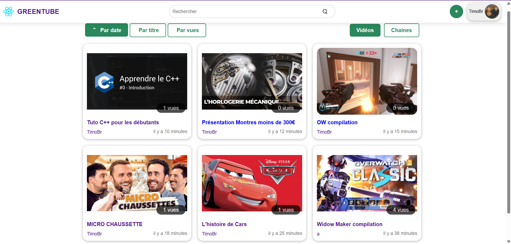<br>
__Fig.8__: Page d'accueil finale<br>
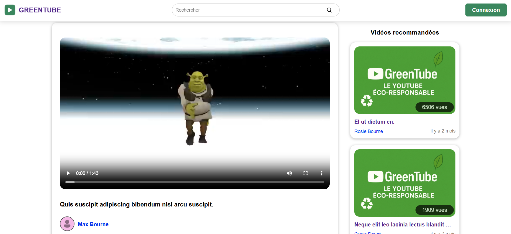<br>
__Fig.9__: Page de vidéo finale<br>
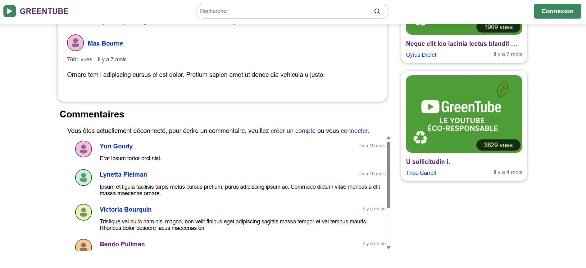<br>
__Fig.10__: Page de vidéo - commentaire<br>
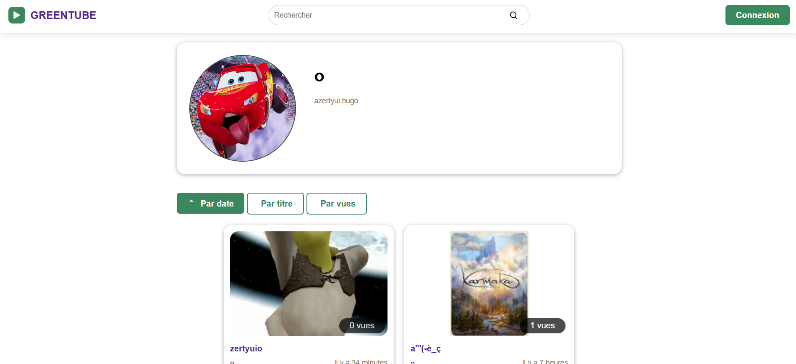<br>
__Fig.11__: Page de chaine finale<br>

### Traitement vidéo avec FFmpeg

Pour la manipulation des fichiers médias, nous avons intégré **ffmpeg-fluent** à notre image backend. La première fonctionnalité déployée est la **génération automatique de miniatures**.

Si l'utilisateur ne fournit pas d'image de couverture, le serveur utilise FFmpeg pour extraire une capture d'écran au milieu de la vidéo. Bien que pratique, cette fonctionnalité soulève des questions en matière d'éco-conception :
> **Note sur l'éco-conception :** L'exécution de processus de traitement vidéo sur le serveur peut être énergivore. Bien que décidée dans l'enthousiasme du développement pour tester les capacités de l'outil, cette fonction mériterait d'être optimisée (par exemple, en limitant la résolution de l'extraction) pour rester cohérente avec nos engagements environnementaux.

## Amélioration du service en matière d'éco-conception

Une fois le service fonctionnel, nous avons concentré nos efforts sur l'optimisation des ressources et la réduction de l'empreinte carbone de l'application, en intervenant sur deux axes majeurs.

### 1. La dénormalisation des données

Initialement, nos données suivaient un modèle relationnel classique. Cependant, ce choix architectural s'est révélé inefficace avec **CouchDB**, qui est une base de données NoSQL orientée documents ne supportant pas les jointures (JOIN).

**Le problème identifié :**
Pour afficher une simple liste de 6 vidéos avec le nom de leur auteur, le backend devait effectuer :
1. Une requête pour récupérer les 6 vidéos.
2. Six requêtes supplémentaires (ou une requête filtrée complexe) pour récupérer les profils utilisateurs correspondants.

Cette multiplication des allers-retours entre le serveur et la base de données (I/O) augmentait inutilement la consommation énergétique du CPU et la latence réseau.

**Comparaison des solutions :**

| Solution | Avantages | Inconvénients |
| :--- | :--- | :--- |
| **Design Views** | Utilise les fonctions natives de CouchDB. | Exploite un comportement instable (`include_docs`), récupère trop de données inutiles et rend la recherche par Regex complexe. |
| **Dénormalisation** | **Une seule requête** suffit pour obtenir toutes les infos d'affichage. | Duplication des données et nécessité de mettre à jour plusieurs documents en cas de modification de profil. |

**Arbitrage technique :**
Nous avons opté pour la **dénormalisation**. Les objets "Vidéo" et "Commentaire" embarquent désormais un objet "User" simplifié (nom, ID, avatar). 

#### Vidéo
```json
{
  "_id": "v0",
  "type": "video",
  "user" : {
    "id_user": "u123",
    "name": "Nom Prénom",
    "avatar": "uploads/avatars/default.png"
  },
  "date": "2024-10-07 14:30:00",
  "name": "Titre de la vidéo",
  "desc": "Description courte du contenu...",
  "path": "uploads/videos/videoTest.mp4",
  "thumbnail": "uploads/thumbnails/default.png",
  "views": 4500
}
```
#### Commentaire
```json
{
  "_id": "c0",
  "type": "comment",
  "user" : {
    "id_user": "u123",
    "name": "Nom Prénom",
    "avatar": "uploads/avatars/default.png"
  },
  "id_video": "v456",
  "date": "2025-01-12 10:15:00",
  "content": "Message de l'utilisateur..."
}
```
* **Résultat :** Le poids de la base est passé de 3.9 MB à 4.5 MB (+15%).
* **Bénéfice Éco :** Cette légère hausse du stockage est largement compensée par la suppression massive de requêtes HTTP et de traitements superflus côté backend, réduisant ainsi la charge serveur globale.

### 2. La fonctionnalité "Mode Podcast" (Audio-only)

La vidéo est le média le plus énergivore du web. Pour répondre à cet enjeu, nous avons développez une fonctionnalité de **Mode Podcast**.

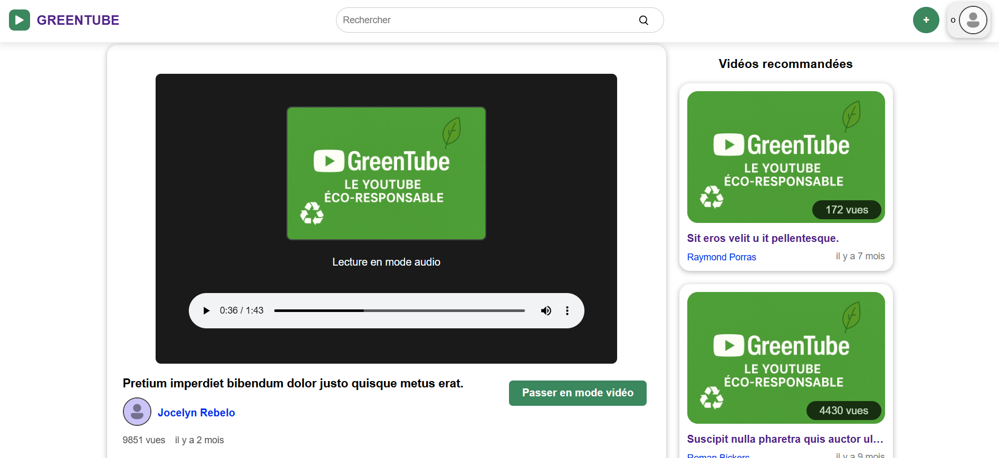<br>
__Fig.12__: Mode podcast<br>

L'idée est de dissocier le flux audio du flux vidéo lors de l'upload via **FFmpeg**. Cette fonctionnalité offre deux avantages majeurs pour l'éco-conception :

1.  **Réduction de la bande passante :** L'utilisateur peut choisir de n'écouter que l'audio. Le flux de données est alors grandement réduit, ce qui est idéal pour une écoute en mobilité ou avec une connexion limitée.
2.  **Sobriété matérielle :** La lecture d'un flux audio seul sollicite beaucoup moins le processeur (CPU/GPU) de l'appareil client, prolongeant ainsi l'autonomie de la batterie et réduisant la consommation électrique.

Cette option permet de transformer notre plateforme de streaming en un service hybride, s'adaptant au besoin réel de l'utilisateur tout en limitant son impact environnemental.

## Analyse finale

Voici l'analyse finale de notre projet.

### GreenIT - ÉcoIndex

#### Scénario consultation d'une vidéo - accueil

| Étape du scénario | EcoIndex | GES (gCO2e) | DOM | Requêtes | Taille (ko) |
| --- | --- | --- | --- | --- | --- |
| **1. Chargement Accueil** | **84 A** 🟩 | 1.32 | 113 | 7 | 29.5 |
| **2. Choisir une vidéo** | **76 A** 🟩 | 1.48 | 96 | 5 | 12.6 |
| **3. Retourner au menu** | **86 A** 🟩 | 1.28 | 113 | 3 | 4.5 |
| **4. Choisir une autre vidéo** | **86 A** 🟩 | 1.28 | 96 | 5 | 12.1 |

__Tab.12__ : Évaluation de l'impact du scénario "Consulter une vidéo - accueil" dans le prototype final.

#### Scénario consultation d'une vidéo - chaine

| Étape du scénario | EcoIndex | GES (gCO2e) | DOM | Requêtes | Taille (ko) |
| --- | --- | --- | --- | --- | --- |
| **1. Chargement de l'accueil** | 74 B 🟦 | 1.52 | 113 | 27 | 93.0 |
| **2. Choisir une chaîne** | **87 A** 🟩 | 1.26 | 88 | 5 | 39.4 |
| **3. Choisir une vidéo** | 75 B 🟦 | 1.51 | 167 | 25 | 29.7 |
| **4. Retourner sur la chaîne** | **76 A** 🟩 | 1.48 | 88 | 5 | 40.0 |
| **5. Choisir une autre vidéo** | **76 A** 🟩 | 1.48 | 97 | 5 | 12.8 |

__Tab.13__ : Évaluation de l'impact du scénario "Consulter une vidéo - chaine" dans le prototype final.

L'aboutissement de ce projet valide l'hypothèse qu'une architecture rigoureuse limite drastiquement l'impact environnemental d'un service numérique. L'évaluation des scénarios "Accueil" et "Chaîne" démontre une efficience majeure, malgré la complexité des fonctionnalités, les émissions de GES stagnent autour de 1.4 gCO2e par étape. Le transfert de données est réduit à moins de 100 ko par page, soit une empreinte 30 fois inférieure à la moyenne du web (3000 ko selon HTTP Archive : https://httparchive.org/reports/page-weight).

Cette performance repose sur un backend agissant comme filtre, garantissant que seule la donnée utile atteint le client. L'augmentation du volume de données n'entraîne aucune croissance énergétique exponentielle, confirmant la scalabilité du modèle. De plus, avec un DOM maintenu sous les 200 éléments, l'application minimise la sollicitation matérielle.

L'obtention des scores EcoIndex A/B semble donc s'appuier sur ces trois leviers : la réduction des appels serveurs, l'optimisation des payloads JSON et une stratégie de mise en cache évitant les transferts redondants.

### GreenFrame 

#### (a) Consultation de la page d'accueil

| Composant | cpu (Wh) | mem (Wh) | disk (Wh) | network (Wh) | screen (Wh) | total (Wh) |
| :--- | :--- | :--- | :--- | :--- | :--- | :--- |
| **Navigateur** | <del>0.00088</del> **0.00083** | <del>0.000051</del> **0.000050** | 0.0 | <del>0.0016</del> **0.0016** | <del>0.080</del> **0.080** | <del>0.083</del> **0.083** |
| **Frontend** | <del>0.000045</del> **0.0000041** | <del>0.0000034</del> **0.0000034** | 0.0 | <del>0.0016</del> **0.0016** | 0.0 | <del>0.0016</del> **0.0016** |
| **CouchDB** | <del>0.00084</del> **0.00073** | <del>0.000071</del> **0.000088** | 0.0 | <del>1.3e-7</del> **1.3e-7** | 0.0 | <del>0.00091</del> **0.00082** |
| **Backend** | **0.00000017** | **0.000021** | 0.0 | **1.3e-7** | 0.0 | **0.000021** |

#### (b) Consultation d'une chaîne

| Composant | cpu (Wh) | mem (Wh) | disk (Wh) | network (Wh) | screen (Wh) | total (Wh) |
| :--- | :--- | :--- | :--- | :--- | :--- | :--- |
| **Navigateur** | <del>0.00074</del> **0.00075** | <del>0.000036</del> **0.000036** | 0.0 | <del>0.0016</del> **0.0016** | <del>0.056</del> **0.056** | <del>0.058</del> **0.058** |
| **Frontend** | <del>0.000037</del> **0.0000038** | <del>0.0000024</del> **0.0000024** | 0.0 | <del>0.0016</del> **0.0016** | 0.0 | <del>0.0016</del> **0.0016** |
| **CouchDB** | <del>0.00061</del> **0.00052** | <del>0.000050</del> **0.000062** | 0.0 | 0.0 | 0.0 | <del>0.00066</del> **0.00058** |
| **Backend** | **0.00000018** | **0.000015** | 0.0 | 0.0 | 0.0 | **0.000015** |

#### (c) Consultation d'une vidéo

| Composant | cpu (Wh) | mem (Wh) | disk (Wh) | network (Wh) | screen (Wh) | total (Wh) |
| :--- | :--- | :--- | :--- | :--- | :--- | :--- |
| **Navigateur** | <del>0.0069</del> **0.0023** | <del>0.00010</del> **0.000086** | 0.0 | <del>0.067</del> **0.045** | <del>0.095</del> **0.095** | <del>0.17</del> **0.14** |
| **Frontend** | <del>0.000022</del> **0.0000035** | <del>0.0000041</del> **0.0000040** | 0.0 | <del>0.046</del> **0.0016** | 0.0 | <del>0.046</del> **0.0016** |
| **CouchDB** | <del>0.0065</del> **0.0081** | <del>0.000085</del> **0.00010** | 0.0 | <del>0.024</del> **0.000052** | 0.0 | <del>0.030</del> **0.0083** |
| **Backend** | **0.00052** | **0.000040** | 0.0 | **0.044** | 0.0 | **0.044** |

__Tab.14__ : Estimation finale de la consommation énergétique de la consultation de l'accueil (a) d'une chaine (b) d'une vidéo (c).

L'analyse des mesures GreenFrame (Tab.14) confirme l'efficience du modèle à trois couches. L'ajout du backend ne se traduit pas par un surcoût, mais par une meilleure répartition de la charge.

Le gain le plus significatif apparaît lors de la consultation vidéo (c) : le CPU du navigateur chute de 0.0069 Wh à 0.0023 Wh. Ce déchargement massif du terminal utilisateur prouve que la logique métier, désormais traitée par le backend, réduit l'effort de calcul côté client.
L'infrastructure serveur (Frontend, Backend, CouchDB) affiche ainsi une consommation extrêmement faible :
- Backend : Son impact est quasi nul lors des phases de navigation fluide (étapes a et b), avec un coût énergétique de l'ordre de $10^{-7}$ Wh.
- Réseau interne : Le transfert entre CouchDB et le Backend est optimisé, réduisant drastiquement la consommation réseau globale lors du chargement initial.

Dans les phases de navigation interne (a et b), la consommation est quasi exclusivement portée par l'écran (95% du total). Cela démontre que la pile logicielle est devenue si sobre que l'impact environnemental dépend désormais principalement du matériel physique et de l'usage de l'utilisateur, et non plus de l'efficacité du code.

### Analyse critique et limites du projet 

Malgré les performances environnementales déjà obtenues, l'analyse du prototype met en évidence plusieurs axes d'amélioration, tant sur le plan technique que méthodologique. Ces améliorations n'ont toutefois pas toutes le même impact en termes de performance et de consommation de ressources.

Sur le plan logiciel, certaines optimisations relèvent d'ajustements relativement mineurs. La gestion du cycle de rendu côté frontend pourrait être affinée par une utilisation plus systématique des mécanismes d'optimisation fournis par React, comme useMemo ou useCallback. Leur absence dans certaines parties du code entraîne des re-rendus évitables du DOM, dont l'impact reste limité mais cumulatif. De la même manière, l'application ne met pas en œuvre de stratégie de purge des feuilles de style, ce qui conduit au chargement de règles CSS inutilisées, ce qui peut poser problème au vu de notre stratégie de CSS modulaire. La mise en place d'un tel mécanisme permettrait d'alléger légèrement les ressources chargées.

D'autres leviers offrent un potentiel d'amélioration plus significatif, notamment sur les formats et la compression des contenus multimédias. Les vidéos et audios sont encore diffusés majoritairement en MP4 et MP3, alors que des formats plus efficaces comme WebM ou Ogg permettraient de réduire sensiblement le volume de données transférées.

Cette optimisation pose toutefois la question du niveau de compression acceptable. Dans la mesure où l'audio et la vidéo participent directement à l'expérience utilisateur, une compression trop agressive peut dégrader la qualité perçue et nuire à l'usage. L'enjeu réside donc dans la recherche d'un compromis entre réduction des flux de données et maintien d'une qualité suffisante.

En parlant d'expérience utilisateur, la question de l'équilibre entre confort d'usage et sobriété peut aussi se poser. Les temps de chargement, notamment pour les vidéos, pourraient être mieux perçus grâce à l'utilisation de skeletons. Toutefois, ces éléments reposent souvent sur des animations CSS continues, dont le coût énergétique doit être évalué au regard du gain réel en ergonomie. Dans le même esprit, bien que le backend applique déjà des filtres, certains objets transmis au frontend contiennent encore des champs superflus. Une sélection plus stricte des données exposées permettrait de réduire la taille des échanges JSON et de limiter les transferts réseau.

Enfin, les analyses précédentes présente certaines limites méthodologiques. Le périmètre étudié s'est concentré sur la consultation de l'accueil, des vidéos et des chaînes, laissant de côté des fonctionnalités comme l'upload ou les podcasts, susceptibles d'avoir des profils de consommation différents. De plus, les tests GreenFrame ont été réalisés sur des séquences de trente secondes. Si cette durée est pertinente pour observer le chargement et l'initialisation de l'application, elle ne reflète pas un usage réel sur la durée, où le streaming vidéo devient le principal poste de dépense énergétique.

## Conclusion

Nous avons tous deux trouvé que ce projet a été une expérience particulièrement formatrice. On a appris à maîtriser une stack technologique moderne. L'utilisation de ReactJS a été un point clef, et même si nous avions déjà eu l'occasion de travailler avec, nous avons pu étendre nos compétences dans ce domaine. La création d'un backend solide avec Node.js et Express a également été très intéressante. Au-delà du code, l'intégration de Docker pour la conteneurisation et la mise en place de workflows de CI/CD via Git nous a sensibilisé aux exigences de déploiement et de qualité logicielle. 

De plus, le coeur de cette UE résidant en l'éco-conception, nous avons pu apprendre à utiliser de nouveaux outils tels que GreenIT et GreenFrame. Cela nous a notamment appris à quantifier l'empreinte environnementale de nos choix techniques. Cette approche nous a forcés à remettre en question nos méthodes de développement pour privilégier une sorte de sobriété numérique, transformant ainsi un projet tel que nous en avons réalisé plusieurs dans le cadre d'autres UE, en une véritable réflexion sur la responsabilité de l'ingénieur. En effet, c'était pour notre part la première fois que nous devions porter autant d'attention aux impacts écologiques de nos codes. C'était donc une expérience très intéressante qui, en plus de nous avoir permis de nous améliorer sur un plan technique, noud a introduit à un sujet qui nous était alors que peu connu et qui s'est avéré être passionnant, mais surtout très important en vue de l'évolution de l'impact des technologies dans le monde.  

Au terme de ce développement, GreenTube propose une plateforme de vidéo en ligne fonctionnelle et optimisée, couvrant un large éventail de fonctionnalités :

- Exploration et navigation : Consultation de vidéos via une page d'accueil dynamique ou par chaîne utilisateur.
- Gestion de contenu : Système d'upload de vidéos avec génération automatique de miniatures.
- Interactivité : Création de comptes, authentification simple et édition de profils personnalisés (avatars et descriptions).
- Recherche et filtrage : Tri avancé des contenus par date, popularité (vues/abonnés) ou via des expressions régulières (Regex) pour des recherches précises.
- Expérience utilisateur : Incrémentation automatique des vues au visionnage et mode "podcast" pour une consultation audio économe en ressources.

En conclusion, notre projet GreenTube démontre qu'il est possible de développer un service riche en fonctionnalités tout en maintenant un faible impact environnemental (Grade EcoIndex A/B). Ce projet marque pour nous une première étape réussie dans la conception de solutions numériques durables et scalables.

## Bonus: Kit de Lancement

### Prérequis 

- Docker Desktop (installé et démarré)
- Node.js ( notre version étant la v22.20.0 )
- Un terminal bash (Git Bash sur Windows, WSL, ou terminal Unix)

### Etapes de lancement

#### Construire le projet

Placez vous dans la racine du projet (cd ..) puis exécuter: 

 - ./setup_local.sh

Le script setup_local.sh vérifie que Docker est lancé, installe les dépendances du front-end et le build, génère des données de test, installe les dépendances du back-end, configure les variables CouchDB, puis démarre les containers Docker afin d'initialiser et lancer le projet en local.

#### Ouvrir le projet dans le navigateur 

Ouvrir son navigateur, et renseigner l'adresse de votre port 80 (http://localhost:80)

Le projet est normalement bien lancé et fonctionnel.
